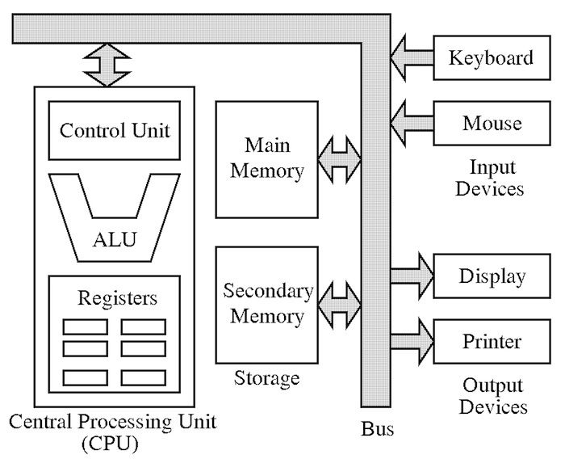

* Von Neuman Model
* Computer Architecture vs Organization
* Moore's Law
* Rock's law

# Von Neuman Model 

### Consist of three hardware systems:

1. CPU (central processing unit) with:
	* ALU (arithmetic logic unit
	* Registers (small storage areas)
	* PC (Program counter)
	* Main-memory system
	* I/O system

2. Capacity to carry out sequential instruction processing

3. Contains a single path (physically or logically) between main memory system and control unit of the CPU, forcing
alternation of instruction and execution cycles. This path is often referred to as the _von Neumann bottleneck_.

#### Execution Cycle (fetch-decode-execute)

This architecture runs programs in what is known as the _von Neumann execution cycle_, also called the
__fetch-decode-execute__ cycle.

1. Control unit fetches next program instruction from memory, using PC to determine where instruction is located.
2. Instruction is decoded into a language the ALU can understand.
3. Any data operands required to execute the instruction are fetched from memory and placed into register within the CPU.
4. ALU executes the instruction and places the results in registers or memory.

---

### Computer Architecture

Concerned with the way hardware components are connected together to form a computer system. It acts as the
interface between hardware and software. It deals with high-level design issues. 

Architecture involves Logic such as Instruction sets, Addressing modes, Data types and Cache optimization.

### Computer Organization

Concerned with the structure and behavior of computer system as seen by the user. It deals with the components
and connections in the system. It tells us how exactly all the units in the system are arranged and interconnected.

An organization is done on the basis of architecture, dealing with low-level design issues.

Organization involves Physical Components such as Circuit design, Adders, Signals and Peripherals.

---

### Moore's Law

In 1996, Intel founder Gordon Moore stated:

> "The density of transistors in an integrated circuit will double every year."

The current version of this predictions is usually conveyed as:

> "the density of silicon chips doubles every 18 month."

### Rock's Law

Proposed by early Intel capitalist Arthur Rock, is a corollary to Moore's law:

> "The cost of capital equipment to build semiconductors will double every four years."

### Relation between Moore and Rock's laws

Certainly, if Moore's Law is to hold, Rock's Law must fall. It is evident evident that
for these two things to happen, computer must shift to a radically different technology.

At this rate by the 2035, not only will the size of a memory element be smaller than an atom,
but it would also require the entire wealth of the world to build a single chip.
