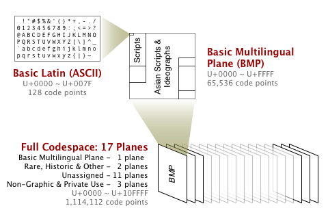

# Character Representation

* Binary-Coded Decimal (BCD)
* EBCDIC
* American Standard Code for Information Interchange (ASCII)
* Unicode


## Binary-Coded Decimal (BCD)

BCD encodes each digit of a decimal number to a 4-bit binary form. When stored in
a 8-bit byte, the upper nibble is called the _zone_ and the lower nibble is called the _digit_.

The high-order nibble (_zone_) in a BCD byte is used to hold the sign, which can have
one of three values, let's see this in the following table:

| Digit 	| BCD  	|
|-------	|------	|
| 0     	| 0000 	|
| 1     	| 0001 	|
| 2     	| 0010 	|
| 3     	| 0011 	|
| 4     	| 0100 	|
| 5     	| 0101 	|
| 6     	| 0110 	|
| 7     	| 0111 	|
| 8     	| 1000 	|
| 9     	| 1001 	|

| Zones 	|          	|
|-------	|----------	|
| 1111  	| Unsigned 	|
| 1100  	| Positive 	|
| 1101  	| Negative 	|

#### packed decimal numbers

The digits of BCD numbers occupy only one nibble, so we can save on space and make
computations simpler when adjacent digits are placed into adjacent nibbles, leaving
one nibble for the sign. This process is known as _packing_.

Example: represent `-1265` in 3 bytes using packed BCD.

The _zoned-decimal_ coding for `1265` is:

```
1111 0001 1111 0010 1111 0110 1111 0101
```

After packing, this string becomes:

```
0001 0010 0110 0101
```

Adding the sign (negative `1101`) after the low-order digit and padding
the high-order digit with ones in 3 bytes we have:

```
unsigned 1 | 2 6 | 5 negative
1111 0001 | 0010 0110 | 0101 1101
```

---

## Extended BCD Interchange Code (EBCDIC)

IBM had used a 6-bit variation of BCD for representing characters and numbers, which was
severely limited in how it could represent and manipulate data, in fact, lowercase letters
were not part of its repertoire.

In order to maintain compatibility with earlier computers and peripheral equipment, the IBM
engineers decided that it would be best to simply expand BCD from 6-bits to 8-bits. Accordingly
this new code was called _Extended BCD Interchange Code_ (EBCDIC).

Characters are represented by appending digit bits to zone bits. For example, the character `a`
is `1000 0001` and the digit `3` is `1111 0011` in EBCDIC. The only difference between upper- to
lowercase characters is in bit position 2, making a translation from upper- and lowercase
a simple matter of flipping one bit. Zone bits also make it easier for a programmer to test
the validity of input data.


## American Standard Code for Information Interchange (ASCII)

In 1967 the International Organization for Standarization (ISO) devised a derivative of a
__7-bit coding scheme__ that defines codes for:

* 32 control characters
* 10 digits
* 52 letters (upper and lower case)
* 32 special characters (such as $ and #)
* space character

The __8th bit was intended to be used for Parity__.

To allow compatibility with telecommunications equipment, computer manufacturers
gravitated toward the ASCII code. As computer hardware became more reliable, however
the need for a parity bit began to fade. In the early 1980s, microcomputer and
microcomputer-peripheral makers began to use the parity bit to provide an __extended
character set for values between 128 and 255__.


#### Parity

_Parity_ is the most basic of all error detection schemes. A bit turned "on/off" depending on whether
the sum of the other bits in the byte is even or odd.

## Unicode

Both EBCDIC and ASCII were built around the Latin alphabet. In 1991, a new international information
exchange code called Unicode was established.

Unicode is a __16-bit alphabet__ that is downward compatible with ASCII and the Latin-1
character set. It has the capacity to encode the majority of characters used in every language
of the world, and also defines an extension mechanism that will allow for the coding of an additional
million characters.



---
