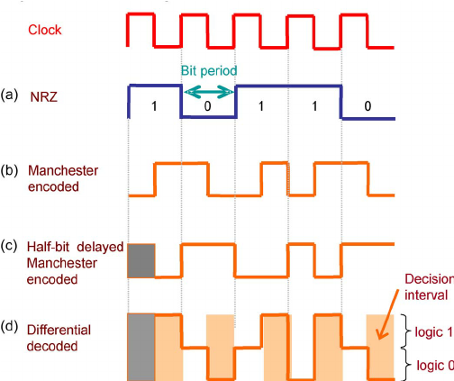
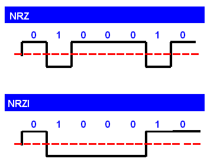
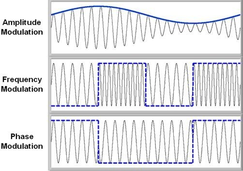
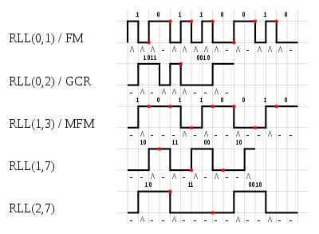

# Data Encoding

* Codes for Data Recording and Transmission
    * Data Encoding definition
* Coding Methods
    * Non_Return-to-Zero (NRZ)
    * NRZ-Inverted (NRZI)
    * Manchester or Phase Modulation (PM)
    * Frequency Modulation (FM) and MFM
    * Run-Length-Limited Code (RLL)
* Error Detection and Correction
    * Cyclic Redundancy Check (Checksums and CRC)
    * Hamming Codes
    * Reed-Soloman (RS)

## Codes for Data Recording and Transmission

ASCII, EBCDIC, and Unicode are represented unambiguously in computer memories. However,
when data is written to some sort of recording medium (such as a tape or disk),
or transmitted over long distances, binary signals can become blurred. This blurring
is partly attributable to timing drifts that occur between senders and receivers. Signal
transitions between the "high" and "low" states of digital signals help to maintain 
synchronization in data recording and communication devices.

To this end, ASCII, EBCDIC and Unicode are __translated into other codes before they
are transmitted or recorded__. This translation is carried out by control
electronics within data recording and transmission devices. __Neither the user nor the
host computer is ever aware that this translation has taken place__.
 
Bytes are sent and received by telecommunications devices by using "high" and "low"
pulses in the transmission media (copper wire, for example). Magnetic storage devices
record data using changes in magnetic polarity called _flux reversals_. __Certain
coding methods are better suited for data communications than for data recording__.



#### Data Encoding

For the sake of brevity, we will use the term __Data encoding__ to mean the process of
converting a simple character code such as ASCII to some other code that better lends
itself to storage or transmission. _Encoded data_ will be used to refer to character
codes so encoded.

---

## Non-Return-to-Zero Code

Simplest data encoding method. We use this code implicitly when we say
that "highs" and "lows" represent 1s and 0s:

* 1s are high voltage (typically positive 3 or 5 volts)
* 0s are low voltage (typically negative 3 or 5 volts)

Each of the bits occupies an arbitrary slice of time in a transmission medium
or an arbitrary speck of space on a disk.
These slices and specks are called __bit cells__.

Unless the receiver is synchronized precisely with the sender, it is not
possible for either to know the exact duration of the signal for each bit cell.
Slow or out-of-phase timing within the receiver might cause a bit sequence
not being properly received. If only one bit is missed in NRZ code, 
the entire message can bear no resemblance to what was sent. 

## NRZ-Invert (NRZI)

The NRZI method addresses part of the problem of synchronization loss.

NRZI provides a transition (either high-to-low or low-to-high) for each
binary one, and no transition for binary zero.

NRZI __eliminates the problem of dropping binary ones__, but we are still
faced with the problem of long strings of zeros causing the receiver or reader to
drift out of phase, potentially dropping bits along the way.

The essential idea behind all coding methods used today in the storage
and transmission of data is to inject sufficient transitions into the
transmitted waveform to keep the sender and receiver synchronized.



## Manchester or Phase Modulation (PM)

The coding method known commonly ad _Phase Modulation_ or _Manchester Coding_
deals with the synchronization problem head-on. PM provides a transition
for each bit, whether a one or a zero. In PM, each binary one is signaled
by an "up" transition, and binary zeros with a "down" transition. Extra transitions
are provided at bit cell boundaries when necessary.

PM is __often used in data transmissions applications__ such as local area networks.
It is __inefficient to use in data storage__, due excessive storage volume
requirements.

## Frequency Modulation (FM)

At least one transition is supplied for each bit cell. These synchronizing
transitions occur at the beginning of each bit cell. To encode a binary 1,
an additional transition is provided in the center of the bit cell.

FM is slightly better than PM with respect to its storage requirements.

FM, however, lends itself to a coding method called _modified frequency modulation_ (MFM),
whereby bit cell boundary transitions are provided only between consecutive zeros.
With MFM, then, at least one transition is supplied for every pair of bit cells,
as opposed to each cell in PM or FM.

With fewer transitions than PM and more transitions than NRZ, MFM is a 
highly effective code in terms of economy and error control. For many years,
MFM was virtually the only coding method used for rigid disk storage.


    
## Run-Length-Limited (RLL)

RLL is a coding method in which block character code words such as
ASCII or EBCDIC are translated into code words specially designed
to limit the number of consecutive zeroes appearing in the code.
An `RLL(d, k) code` allows a minimum of `d` and a maximum of `k` consecutive
zeros to appear between any pair of consecutive ones.

Clearly, RLL code words must contain more bits than the original character
code. However, because RLL is coded using NRZI on the disk, RLL-coded data
actually occupies less space on magnetic media because fewer flux transitions
are involved. The code words employed by RLL are designed to prevent
a disk from losing synchronization as it would if a "flat" binary NRZI code
were used.

Although there are many variants, RLL(2, 7) is the predominant code used by
magnetic disk systems. it is technically a 16-bit mapping of 8-bit ASCII or
EBCDIC characters. However, it is nearly 50% more efficient tan MFM in terms
of flux reversals.

RLL is a form of data compression called __Huffman coding__, where the most likely
information bit patterns are encoding using the shortest code word bit patterns.



---

# Error Detection and Correction

No communication channel or storage medium can be completely error-free.

As transmission rates are increased, bit timing gets tighter. As more bits are
packed per square millimeter of storage, flux densities increase. Error rates
increase in direct proportion of those.

We mentioned that a parity bit could be added to an ASCII byte to help
determine whether any of the bits had become corrupted during transmission. This
is limited in its effectiveness. Simple parity can detect only an odd numbers
of errors per byte. If two errors occur, we are helpless.

Error detection and correction is yet another study in the trade-offs that one
must make in designing computer systems. 

> The well-constructed error control system is therefore a system where a "reasonable" number of the "reasonably" expected
errors can be detected or corrected within the bounds of "reasonable" economics.

## Cyclic Redundancy Check (Checksums and CRC)

Checksums are used in a wide variety of coding systems, from bar codes
to ISBNs. Self-checking codes that will quickly indicate whether the
preceding digits have been misread.

CRC is a type of checksum used primarily in data communications that
determines whether an error has occurred within a large block or stream
of information bytes. The larger the block to be checked, the larger
the checksum must be to provide adequate protection.

Checksums and CRCs are a type of _systematic error detection_ scheme,
meaning that the error-checking bits are appended to the original information
byte. The group of error-checking bits is called a __syndrome__.
 
The word __cyclic_ in Cyclic Redundancy Check, refers to the abstract
mathematical theory behind this error control system.

## Hamming Codes

In data communications, it is sufficient to have only the ability to 
detect errors. If a communications device determines that a message contains
an erroneous bit, all it has to do is request retransmission. Storage devices
and memory must have the ability to not only detect but to correct a reasonable
number of errors.

Error-recovery coding has been studied intensively.

One of the oldest and most effective does is the __Hamming code__. This is
an adaptation of the concept of parity, whereby error detection and correction
capabilities are increased in proportion to the number of parity bits
added to an information words.

Hamming codes are used in situations where random errors are likely to occur.
We assume each bit failure has a fixed probability of occurrence
independent of other bit failures. It is common for computer memory
to experience such errors.

The memory word itself consists of `m` bits for `r` redundant bits are
added to allow for error detection and/or correction. Thus the final word, called
a `code` word, is an `n`-bit unit containing `m`+`r` bits. There exist
a unique code word consisting for `n = m + r` bits for each data word as follows:
`m bits | r bits`. The number of bit positions in which two code words differ
is called the __Hamming distance__ of those two code words.

For example, if we have the following two code words:

```
1000 1001
1011 0001
  ** *
```

The _Hamming distance_ of these two code words is 3. This is important in the
context of error detection. If two code words are a Hamming distance `d` apart,
`d` single-bit errors are required to convert one code word to the other, which
implies this type of error would not be detected. Therefore, if we wish
to create a code that guarantees detection of all single-bit errors, all pairs of
code words must have a Hamming distance of at least 2. If an `n`-bit word
is not recognized as a legal code word, it is considered an error.

The _minimum Hamming distance_ for the code, determines its error detecting
and correcting capability.

## Reed-Soloman (RS)

Hamming codes are useless in situations where there is a likelihood that
multiple adjacent bits will be damaged. These kinds of errors are called
__burst errors__. Because of their exposure to mishandling
and environmental stress, burst errors are common on removable media such
as magnetic tapes and compact disks.

If we expect errors to occur in blocks, it stands to reason that we
should use an error-correcting code that operates on block leven,
as opposed to a Hamming-code, which operates at the bit-level.

RS code can be though of as a CRC that operates over entire characters
instead of only a few bits. RS, like CRC, are systematic: The parity
bytes are appended to a block of information bytes.

RS error-correction algorithms are implemented in high-performance disk drives
as well as compact disks for music and data storage.
