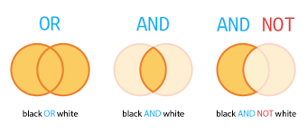
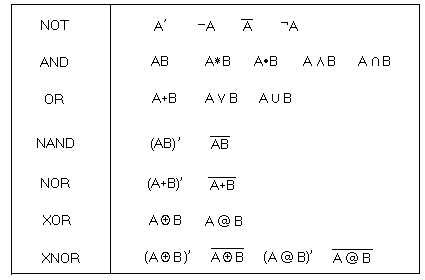
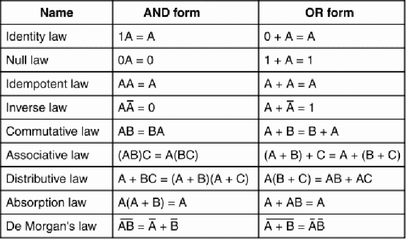

# Boolean Algebra

Boolean Algebra is an algebra for the manipulation of objects that can
take on onl two values (typically true or false).

* Boolean expressions
* Boolean operators
* Boolean identities
* Representing boolean functions
    * sum-of-products
    * product-of-sums

#### Boolean Expressions

Combining the variables and operators yields _Boolean_ expressions.

A _Boolean function_ typically has one or more input values and yields
a result, based on these input values, in the range `{0, 1}`.

#### Boolean Operators

Basics
* AND (`.`)
* OR (`+`)
* NOT (`!`)

#### Boolean identities

Boolean expressions can be simplified, for that we need identities/laws
that apply to Boolean algebra instead of regular algebra.

### Representing Boolean Functions

There are an infinite numbers of Boolean expressions that are
_logically equivalent_ to one another. For any given Boolean function,
there exists a unique _standardized form_.

The two most common standardized forms:
* sum of products
* product of sums

#### Sum of Products

Expression must be a collection of __ANDed__ variables (or product terms) that are __ORded together__.

The function `F(x,y,z) = xy + !(yz) + xyz` is in sum-of-products form.

#### Product of sums

Expression must consist of __ORded__ variables (sum terms) that are __ANDed together__.

The function `F(x,y,z) = (x+y)(x+!z)(y+!z)(y+z)` is in product-of-sums form.
