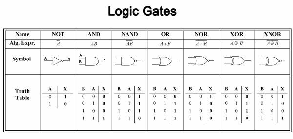
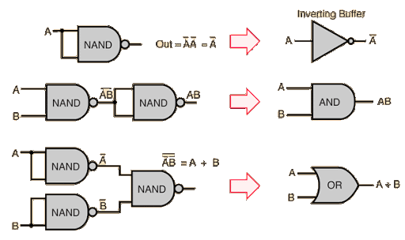
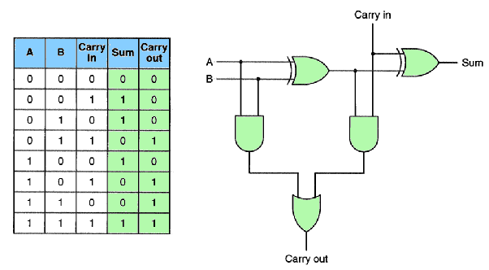
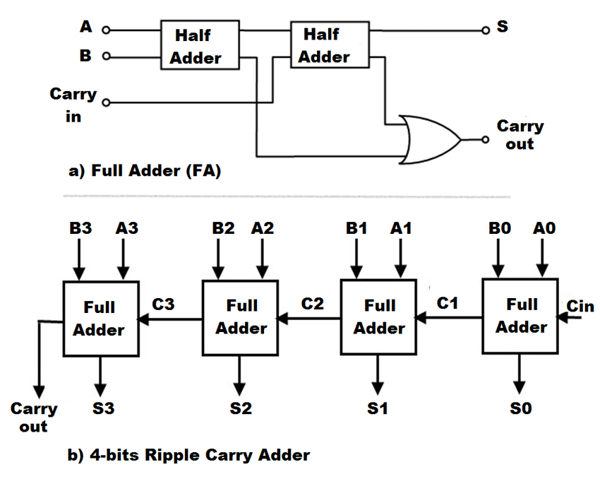
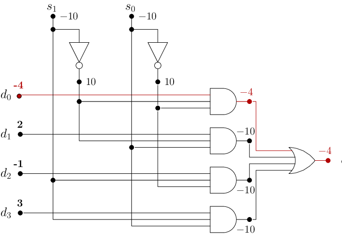
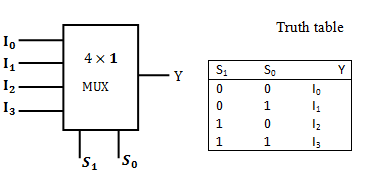
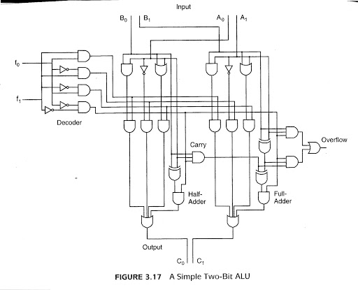
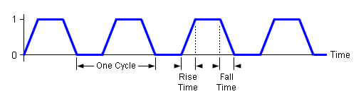
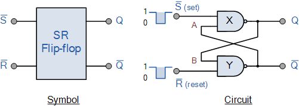
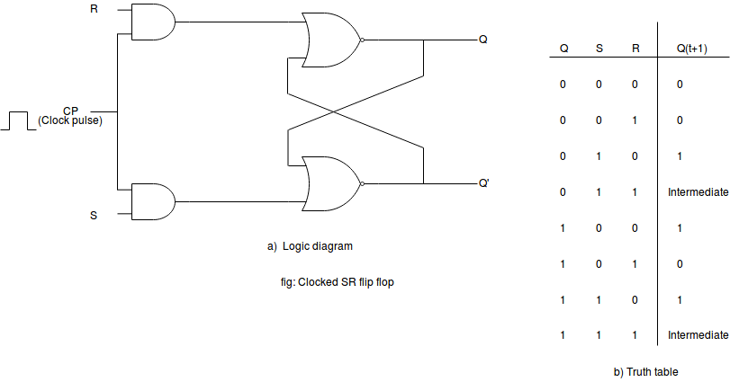

# Digital Logic

* Logic Gates
* Digital Components
    * Integrated Circuits
* Combinational Circuits
    * Adders
    * Decoder
    * Multiplexer
    * Parity Checker and Generator
* Sequential Circuits
    * Clocks
    * Flip Flops (Latch)
        * SR (set/reset)

## Logic Gates

The actual physical components or digital circuits, are constructed from
a number of primitive elements called _gates_. Gates implement each of
the basic boolean logic functions.

Formally, a gate is a small, electronic device that computes various functions
of two-valued signals.

> The basic physical component of a computer is the transistor,
> the basic logic element is the gate.

#### Symbols for Logic Gates

#### Universal Gates

The __NAND__ gate is commonly referred to as a universal gate.

Any electronic circuit can be constructed using only NAND gates.

---

## Digital Components

#### Relation to Boolean Algebra

We simplify our circuits by simplifying our Boolean expression. Digital circuits
are implemented with gates, but gates and logic diagrams are not the most convenient
forms for representing digital circuits during the design phase.

#### Integrated Circuits

The actual hardware of a computer uses collections of gates to create larger modules, which in turn,
are used to implement various functions.

Typically gates are not sold individually, they are sold in units called integrated circuits (ICs).
Digital logic chips are combined to give us useful circuits. These logic circuits can be categorized
as either _combinational logic_ or _sequential logic_. 

---

## Combinational Circuits

Circuits that contain basic Boolean operator, inputs and outputs. The key concept in recognizing a
combinational circuit is that an output is always based entirely on the given inputs, thus, __the
output of a combinational circuit is a function of its inputs__.

A given combinational circuit may have several outputs. If so, each output represents a different
Boolean function.

### Adders 

Adders are very important circuits, a computer would not be very useful if it could not
add numbers.

#### Half Adder

 

#### Full Adder

The problem of adding two binary digits together.

#### Ripple Carry Adder

> Sequential generation of carries that "ripple" through the adder stages.

### Decoder

An equally important operation that all computer use frequently is decoding binary information
from a set of `n` inputs to a maximum of `2^n` outputs.

A _decoder_ uses the inputs and their respective values to select one specific output line. This simply
means that one unique output line is asserted (or set to 1), while the other output lines are set
to zero.

Decoders are normally defined by the number of inputs and outputs. For example, a decoder that
has 3 inputs and 8 inputs, is called a _3-to-8 decoder_.

### Multiplexer

Selects binary information from one or many input lines and directs it to a single output line.

Selection of a particular input line is controlled by a set of selection variables or control lines. At any
given time, only one input is routed through the output line. All other inputs are "cut off".

Time-sharing computers multiplex the input from user terminals. Modem pools multiplex the modem lines
entering the computer.

### Parity Generator

Circuit that creates the necessary parity bit to add to a word.

### Parity checker

Checks to make sure proper parity (odd or even) is present in the word, detecting an
error if the parity bit is incorrect.

## 2-bit ALU

--

## Sequential Circuits

The major weakness of combinational circuits is that there is no concept of storage.

A sequential circuit defines the output as a __function of both is current inputs
and its previous inputs__. To remember previous inputs, sequential circuits must have some
sort of storage elements (_flip-flop_).

### Clocks

A clock is a circuit that emits a __series of pulses with a precise pulse width and precise interval__
between consecutive pulses. This interval is called the _clock cycle time_, generally measured in
megahertz (MHz), or million of pulses per second.

The fact that a sequential circuit uses past inputs to determine present outputs indicates
we must have _event ordering_. Some sequential circuits are _asynchronous_, which means they
become active the moment any input value changes. _Synchronous_ sequential circuits use
clocks to order events.

A clock is used by a sequential circuit to decide when to update the state of the circuit. Most sequential
circuits are _edge-triggered_ (as opposed to being _level-triggered_) which means they are allowed to
change their states on either the rising or falling edge of the clock signal.

### Flip Flops (latch)

A level-triggered circuit is allowed to change state whenever the clock signal is either high or low. Technically
a latch is level-triggered, where a flip-flop is edge-triggered.

> In order to "remember" a past state, sequential circuits rely on a concept called __feedback__. The input of a
circuit is fed back as an input to the same circuit.

We can describe any flip-flop by using a _characteristic table_, which indicates what the next state
should be based on the inputs and the current state.

#### SR Flip Flop (Set/Reset)

The most basic memory unit.

