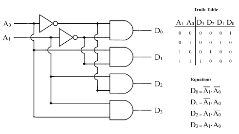

# Digital Logic

* Logic Gates
* Digital Components
    * Integrated Circuits
* Combinational Circuits

## Logic Gates

The actual physical components or digital circuits, are constructed from
a number of primitive elements called _gates_. Gates implement each of
the basic boolean logic functions.

Formally, a gate is a small, electronic device that computes various functions
of two-valued signals.

> The basic physical component of a computer is the transistor,
> the basic logic element is the gate.

#### Symbols for Logic Gates

#### Universal Gates

The __NAND__ gate is commonly referred to as a universal gate.

Any electronic circuit can be constructed using only NAND gates.

---

## Digital Components

#### Relation to Boolean Algebra

We simplify our circuits by simplifying our Boolean expression. Digital circuits
are implemented with gates, but gates and logic diagrams are not the most convenient
forms for representing digital circuits during the design phase.

#### Integrated Circuits

The actual hardware of a computer uses collections of gates to create larger modules, which in turn,
are used to implement various functions.

Typically gates are not sold individually, they are sold in units called integrated circuits (ICs).
Digital logic chips are combined to give us useful circuits. These logic circuits can be categorized
as either _combinational logic_ or _sequential logic_. 

---

## Combinational Circuits

Circuits that contain basic Boolean operator, inputs and outputs. The key concept in recognizing a
combinational circuit is that an output is always based entirely on the given inputs, thus, __the
output of a combinational circuit is a function of its inputs__.

A given combinational circuit may have several outputs. If so, each output represents a different
Boolean function.

### Adders 

Adders are very important circuits, a computer would not be very useful if it could not
add numbers.

#### Half Adder

 

#### Full Adder

The problem of adding two binary digits together.

#### Ripple Carry Adder

> Sequential generation of carries that "ripple" through the adder stages.

### Decoder

An equally important operation that all computer use frequently is decoding binary information
from a set of `n` inputs to a maximum of `2^n` outputs.

A _decoder_ uses the inputs and their respective values to select one specific output line. This simply
means that one unique output line is asserted (or set to 1), while the other output lines are set
to zero.

Decoders are normally defined by the number of inputs and outputs. For example, a decoder that
has 3 inputs and 8 inputs, is called a _3-to-8 decoder_.

### Multiplexer
